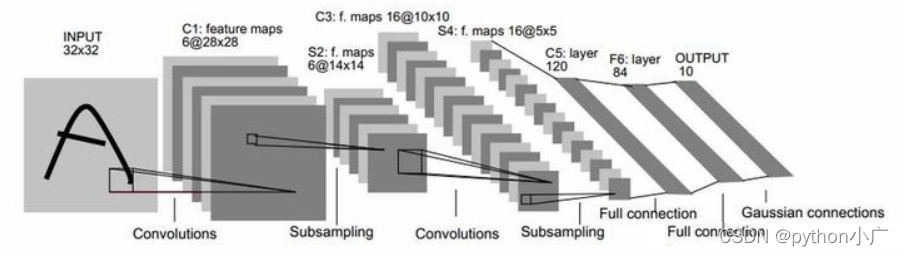
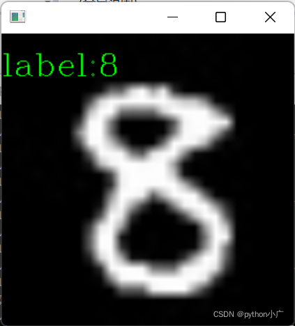

# LeNet5_tensorflow2
使用tensorflow2 搭建LeNet5网络，训练MNIST数据集，详细讲解已上传之CSDN [https://blog.csdn.net/qq_45723275/article/details/122667592?spm=1001.2014.3001.5501](https://blog.csdn.net/qq_45723275/article/details/122667592?spm=1001.2014.3001.5501) ，最后使用c++ opencv4.5.5完成模型部署。

## 综述

LeNet5 这个网络包含了深度学习的基本模块：卷积层，池化层，全链接层。是其他深度学习模型的基础。LeNet-5共有7层，不包含输入，每层都包含可训练参数；每个层有多个Feature Map，每个FeatureMap通过一种卷积滤波器提取输入的一种特征，然后每个FeatureMap有多个神经元。本人将激活函数更换为Mish
## 环境配置
本人环境配置如下：
> pycharm2021
> vs2022
> Anaconda3
> tensorflow=2.4

## 预测结果

